# Point of Sale System  - Java

POS help the shop's owners by store the some information with every purchase made by customers. It has  a unique transaction number assigned to every transaction, the items purchased and their prices, the date and time of the transaction, discounts applied to the transaction (if any), and the total price of all the items bought. For the database of items, the system will only store information about the products offered in the shop. The product type may be devices or accessories, the system shall be able to store the unique product identification number, the product name, product type, the price the item was bought, and the selling price, for each item in the database. 

This system is a software application that eliminates the need for additional manual hours spent on record keeping and income report generation. This application stores data in a centralized location that is accessible to all users at the same time. It is extremely simple to manage historical data in a database. Employees do not need any special training to use this application. They can easily use the tool, which reduces manual hours spent on routine tasks and thus improves performance. Because the data is centralized, it is very simple to keep track of the various items' stocks. 

## Technologies & Tools

Programming Language:
- Java

IDE:
- Apache Netbeans 15
- Wampserver

## Functional Requirements 

- Retrieve name and price of good 
- Handle Payment 
- Handle Payment cash 
- Handle Payment check 
- Handle Payment credit card 
- Print Receipt 
- Deduct stock amount of good 
- Compute total amount 
- Handle login 
- Handle logout 

## Non-functional requirements 

- Each function should respond less than 1s of time 
- Secure payments of credit card 
- Warranty access for only for authorized users 

## Product Functions 

-   The Transactions Module provides facilities for the cashier to record and manage customer orders. Including Add order and Bill out. 

-  The Administration Module provides facilities for the administrator to manage the menu and item details. Including Add item, Edit item, Delete item, and Create new account.  

-  The reports module provides facilities for the administrator to view sales report, view transactions log, and track cashier performance. 

## Operating Environment 

- The system shall be compatible with the Microsoft Windows Operating System (NT, 2000, XP or greater). 

- The Environment of this software : Operating system : windows 10 (version 1.0) 

## Screenshots

### Loading
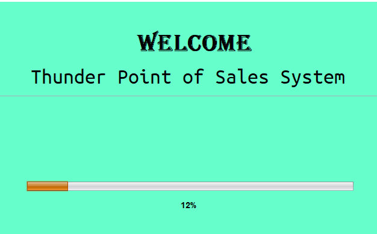

### login
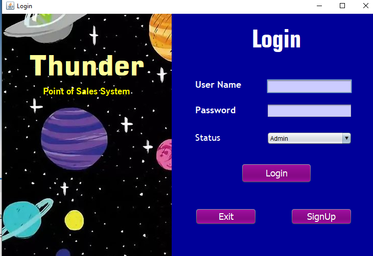

### Sign Up
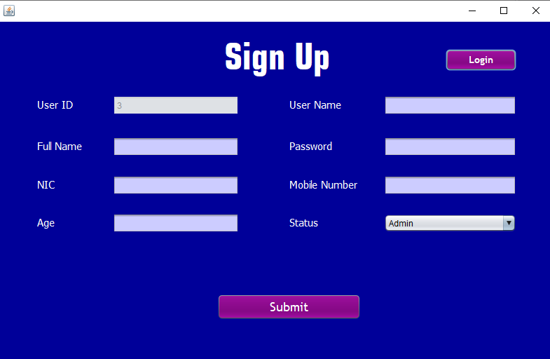

### Main Dashboard
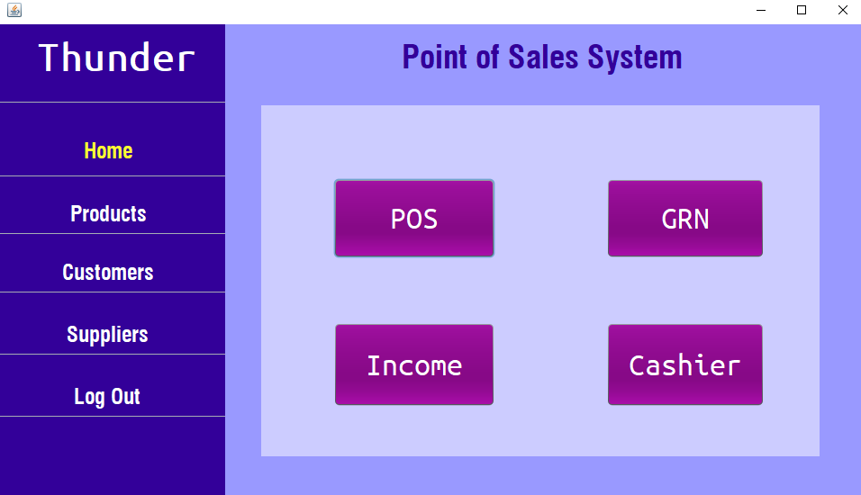

### Products
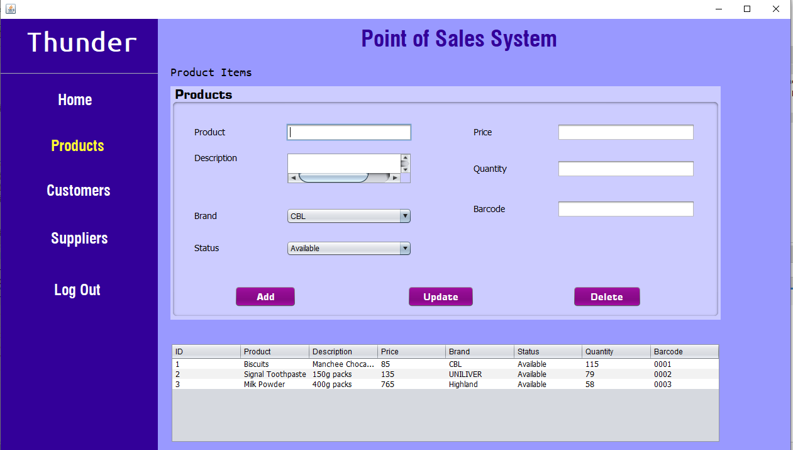

### Customers
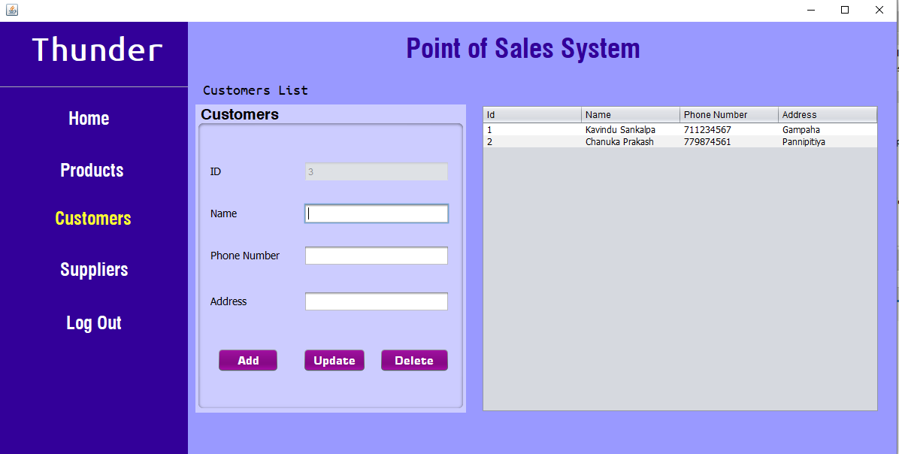

### Suppliers
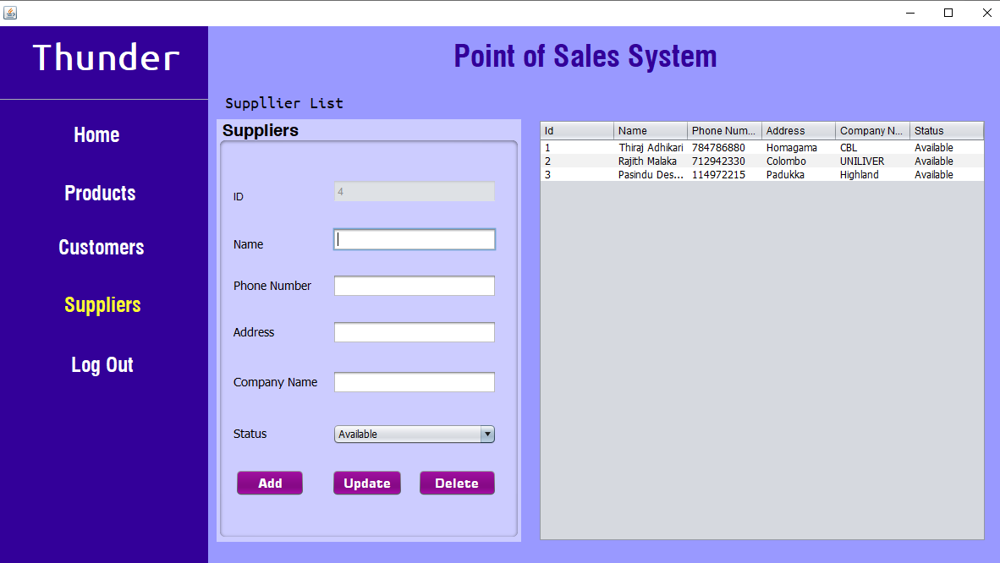

### Transactions
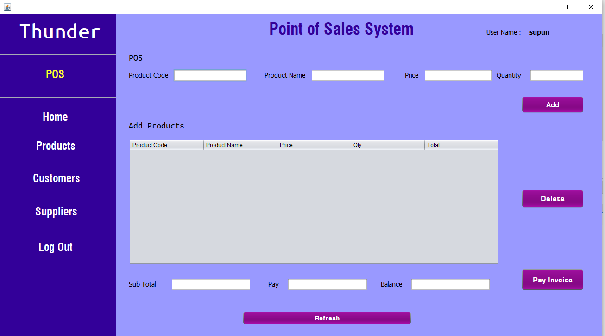

### Good Recieved Note
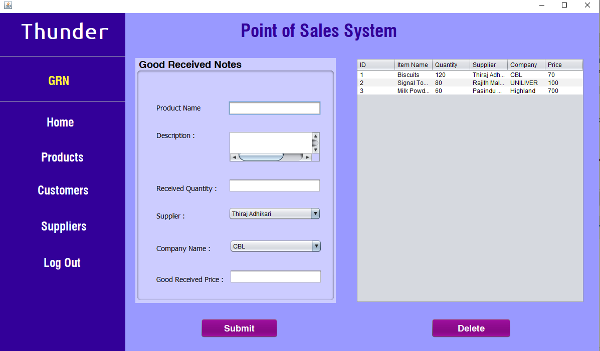

### Income
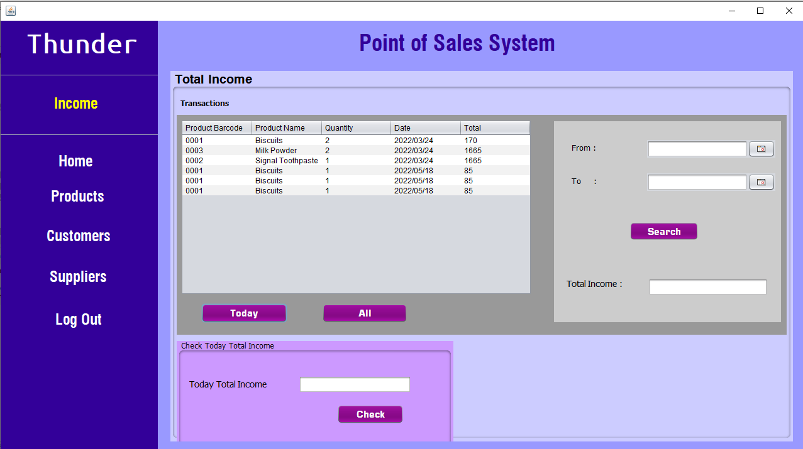

### Cashier 
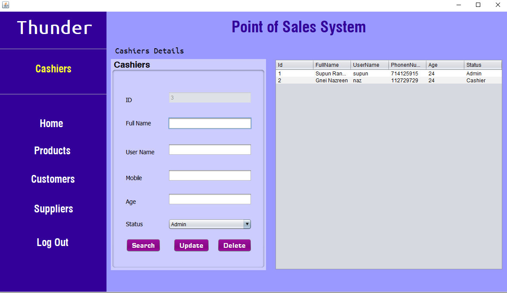

### Receipt
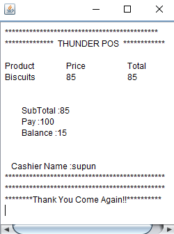

## Contributors

This project is a group project. We would like to acknowledge the following individuals for their contributions to this project:

- A.M.T.S.Adhikary 
    - Designed & developed the user interface
    - Assisted with project management and coordination

- Gnei Nazreen Smahon 
    - Designed the user interface
    - Created the documentation and user guide

- U.K.R.Malaka 
    - Optimized performance and conducted testing
    - Assisted with project management and coordination

- U.K.Supun Randika 
    - Designed & developed the user interface
    - Assisted with database integration

Special thanks to our project supervisor Mr.Geeth Hanarasinghe ( Associate Vice President – Global PMO at Fortude ) and to all the contributors for their hard work and dedication to this project. Your contributions have been invaluable!

